# Workflow Détaillé - Traitement PDF

## Diagramme de Flux Complet

```mermaid
flowchart LR
    direction TB
    A[📤 PDF Uploadé] --> B[📄 Ouverture PDF PyMuPDF]
    B --> C[📊 Comptage Pages]
    C --> D[🔄 Boucle par Page]
    D --> E[🖼️ Conversion Page → Image]
    E --> F[🎨 Conversion RGB]
    F --> G[📦 Encode PIL → Base64]
    G --> H[🤖 Préparation Message Mistral]
    H --> I[📡 Appel API Mistral Vision]
    I --> J[📝 Extraction Markdown]
    J --> K[📊 Création Document]
    K --> L[🔄 Page Suivante?]
    L -->|Oui| D
    L -->|Non| M[🧹 Nettoyage Fichiers]
    M --> N[📋 Résumé Final]
    
    subgraph "Upload & Initialisation"
        A
    end
    
    subgraph "Traitement PDF"
        B
        C
        D
    end
    
    subgraph "Conversion Image"
        E
        F
        G
    end
    
    subgraph "Mistral Vision"
        H
        I
        J
    end
    
    subgraph "Traitement Contenu"
        K
        L
    end
    
    subgraph "Finalisation"
        M
        N
    end
    
    style A fill:#e3f2fd
    style B fill:#f5f5f5
    style C fill:#f5f5f5
    style D fill:#e3f2fd
    style E fill:#fff3e0
    style F fill:#ffebee
    style G fill:#8d6e63
    style H fill:#f3e5f5
    style I fill:#e8f5e8
    style J fill:#8d6e63
    style K fill:#f3e5f5
    style L fill:#e3f2fd
    style M fill:#fff3e0
    style N fill:#c8e6c9
```



## Disposition Verticale par Section

### 📤 **Upload & Initialisation**
```
📤 PDF Uploadé
```

### 📄 **Traitement PDF** (une sous l'autre)
```
📄 Ouverture PDF PyMuPDF
📊 Comptage Pages
🔄 Boucle par Page
```

### 🖼️ **Conversion Image** (une sous l'autre)
```
🖼️ Conversion Page → Image
🎨 Conversion RGB
📦 Encode PIL → Base64
```

### 🤖 **Mistral Vision** (une sous l'autre)
```
🤖 Préparation Message Mistral
📡 Appel API Mistral Vision
📝 Extraction Markdown
```

### 📊 **Traitement Contenu** (une sous l'autre)
```
📊 Création Document
🔄 Page Suivante?
```

### 🧹 **Finalisation** (une sous l'autre)
```
🧹 Nettoyage Fichiers
📋 Résumé Final
```

## Étapes Détaillées du Code

### 1. 📤 **PDF Uploadé**
```python
# Ligne 236 - process_uploaded_pdfs()
uploaded_files: List[BinaryIO]  # Fichiers uploadés en mémoire
```

### 2. 💾 **Sauvegarde Temporaire**
```python
# Lignes 250-258
for uploaded_file in uploaded_files:
    file_basename = uploaded_file.name
    file_path = os.path.join(temp_dir, file_basename)
    with open(file_path, "wb") as f:
        f.write(uploaded_file.getvalue())  # Sauvegarde binaire
```

### 3. 📁 **Création Répertoire Temp**
```python
# Ligne 248
os.makedirs(temp_dir, exist_ok=True)  # Crée "temp_pdf" si n'existe pas
```

### 4. 🔧 **Initialisation Mistral Client**
```python
# Lignes 250-255
client = MistralClient(api_key=os.getenv("MISTRAL_API_KEY"))
model_name = config.VISION_MODEL_NAME
```

### 5. 📄 **Ouverture PDF PyMuPDF**
```python
# Lignes 111-113
pdf_document = fitz.open(file_path)  # PyMuPDF
total_pages = len(pdf_document)
```

### 6. 🖼️ **Conversion Page → Image**
```python
# Lignes 147-150
page = pdf_document[page_num]
pix = page.get_pixmap(matrix=fitz.Matrix(300/72, 300/72))  # 300 DPI
img = Image.frombytes("RGB", [pix.width, pix.height], pix.samples)
```

### 7. 🎨 **Conversion RGB**
```python
# Lignes 87-91 - encode_pil_image()
if pil_image.mode == 'RGBA':
    pil_image = pil_image.convert('RGB')
elif pil_image.mode != 'RGB':
    pil_image = pil_image.convert('RGB')
```

### 8. 📦 **Enregistrement dans Buffer**
```python
# Lignes 84-85 - encode_pil_image()
buffered = io.BytesIO()  # Crée un buffer en mémoire
pil_image.save(buffered, format=save_format)  # Sauvegarde dans buffer
```

### 9. 🔄 **Extraction depuis Buffer**
```python
# Lignes 96-97 - encode_pil_image()
img_byte = buffered.getvalue()  # Récupération des données binaires
return base64.b64encode(img_byte).decode('utf-8'), save_format.lower()
```

### 10. 🤖 **Préparation Message Mistral**
```python
# Lignes 154-165
messages = [
    {
        "role": "user",
        "content": [
            {"type": "text", "text": markdown_prompt},
            {
                "type": "image_url",
                "image_url": f"data:image/{image_format};base64,{base64_image}"
            }
        ]
    }
]
```

### 11. 📡 **Appel API Mistral Vision**
```python
# Lignes 171-179
chat_response = client.chat(
    model=model_name,
    messages=messages
)
page_content = chat_response.choices[0].message.content
```

### 12. 📝 **Extraction Markdown**
```python
# Lignes 120-135 - Prompt Markdown
markdown_prompt = """
You are an expert document analysis assistant. Extract ALL text content from the image and format it as clean, well-structured GitHub Flavored Markdown.

Follow these formatting instructions:
1. Use appropriate Markdown heading levels based on visual hierarchy
2. Format tables using GitHub Flavored Markdown table syntax
3. Format key-value pairs using bold for keys: `**Key:** Value`
4. Represent checkboxes as `[x]` or `[ ]`
5. Preserve bulleted/numbered lists using standard Markdown syntax
6. Maintain paragraph structure and line breaks
7. Extract text labels from diagrams/images
8. Ensure all visible text is captured accurately

Output only the generated Markdown content.
"""
```

### 13. 📊 **Création Document**
```python
# Lignes 190-197
chunk_doc = Document(
    page_content=page_content,  # Contenu Markdown extrait
    metadata={
        'source': file_basename,
        'page': page_num + 1
    }
)
```

### 14. 🧹 **Nettoyage Fichiers**
```python
# Lignes 295-301
for path in saved_file_paths:
    try:
        os.remove(path)  # Supprime fichiers temporaires
    except OSError as e:
        logger.warning(f"Could not remove temporary file {path}: {str(e)}")
```

## Détails Techniques

### 🔄 **Traitement Parallèle**
```python
# Lignes 260-275
with ThreadPoolExecutor(max_workers=min(len(saved_file_paths), 4)) as executor:
    tasks = []
    for file_path in saved_file_paths:
        task = loop.run_in_executor(
            executor,
            lambda p, b: asyncio.run(process_single_pdf(p, b, client, model_name)),
            file_path,
            file_basename
        )
        tasks.append(task)
    results = await asyncio.gather(*tasks)
```

### 📊 **Résumé de Performance**
```python
# Lignes 225-228
logger.info(f"Total pages processed: {total_pages_processed}")
logger.info(f"Total chunks created: {len(all_docs)}")
logger.debug(f"Average chunk size: {sum(len(doc.page_content) for doc in all_docs) / len(all_docs):.2f} characters")
```

## Formats de Données

### 🖼️ **Image Processing**
- **Résolution**: 300 DPI (fitz.Matrix(300/72, 300/72))
- **Format**: RGB (conversion automatique depuis RGBA)
- **Encodage**: Base64 (PNG par défaut)

### 📝 **Markdown Output**
- **Titres**: # ## ###
- **Tableaux**: | Colonne | Valeur |
- **Clés-Valeurs**: **Key:** Value
- **Checkboxes**: [x] [ ]
- **Listes**: - * 1. 2.

### 📄 **Métadonnées**
```json
{
  "source": "document.pdf",
  "page": 1
}
```

## 🔄 **Processus Buffer Détaillé**

### 📦 **Étape 1 : Création du Buffer**
```python
# Ligne 84 - encode_pil_image()
buffered = io.BytesIO()  # Crée un buffer en mémoire pour stocker temporairement l'image
```

### 💾 **Étape 2 : Enregistrement dans Buffer**
```python
# Lignes 93-94 - encode_pil_image()
pil_image.save(buffered, format=save_format)  # Sauvegarde l'image dans le buffer
```

### 🔄 **Étape 3 : Extraction depuis Buffer**
```python
# Ligne 96 - encode_pil_image()
img_byte = buffered.getvalue()  # Récupération des données binaires de l'image
```

### 📤 **Étape 4 : Conversion Base64**
```python
# Ligne 97 - encode_pil_image()
return base64.b64encode(img_byte).decode('utf-8'), save_format.lower()
```

### 📝 **Étape 5 : Enregistrement dans Page Content**
```python
# Lignes 179-180
page_content = chat_response.choices[0].message.content  # Contenu Markdown extrait
# page_content contient maintenant le texte structuré en Markdown
``` 